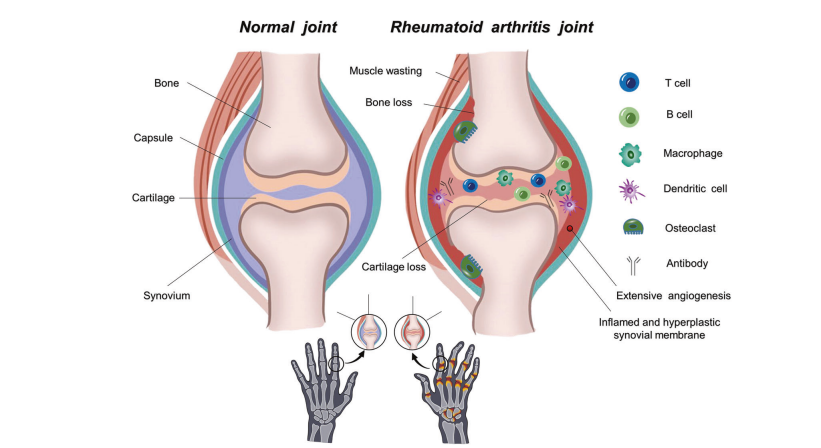
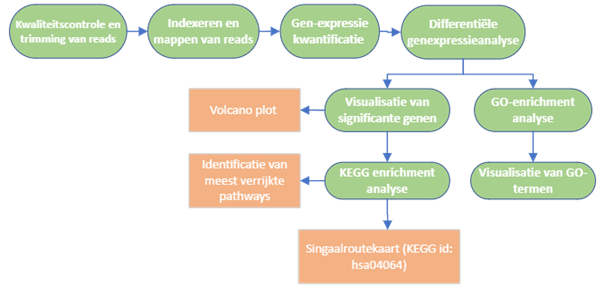

# Transcriptomics analyse reumatoide-artritis
Transcriptomics analyse in R van eiwit-gerelateerde genexpressie in reumatoïde artritis versus gezonde controles 

<figure style="text-align: center;">
  
</figure>

[(Ding. et al., 2023)](bronnen/ding_etal_2023.pdf)

# Introductie
Reumatoïde artritis (RA) is een chronische auto-immuun ontstekingsziekte en brengt schade en functieverlies toe aan de gewrichten. De ziekte kan zich ook extra-articulair manifesteren, waarbij er aantasting op treed aan de huid, ogen, hart, longen, nieren, zenuwstelsel en maagdarmstelsel [(Radu & Bungau., 2021)](bronnen/radu_etal_2021.pdf). RA komt wereldwijd voor bij 1-2% van de bevolking, en wordt bij vrouwen twee tot drie keer vaker aan getroffen dan in mannen [(Kang. et al., 2022)](bronnen/kang_etal_2022.pdf). RA ontwikkeld zich in het begin met aspecifieke symptomen, dit maakt het lastig de aandoening in een vroeg stadium vast te stellen. Onbehandeld leid de ziekte tot een verhoogd functieverlies en mortaliteit [(Chauhan. et al., 2023)](bronnen/chauchan_etal_2023.pdf). Medicijnen zijn er om de ziekte onder controle te houden en richten zich op ontstekingsmediatoren zoals tumornecrosefactor (TNF)-α, en B-cellen. De behandeling zijn niet voor iedere RA patiënt effectief, maar leiden wel tot nadelige bijwerkingen [(Wang. et al., 2024)](bronnen/wang_etal_2024.pdf). Onderzoek is nodig naar het identificeren van RA in patiënten voor betere behandeling met geneesmiddelen. In dit onderzoek wordt een transcriptomics analyse uitgevoerd op RNA- sequence gegevens van RA patiënten. Hiermee wordt het genexpressie profiel van RA patiënten in kaart gebracht om bio markers op te sporen, en zo bij te dragen aan een beter begrip van potentiële behandelmogelijkheden, cel regulatie en de regulerende netwerken in de ontwikkeling van RA.

# Methode
**Synoviale weefselmonsters**

De RNA-sequence gegevens van de synovium biopten werden verkregen uit eerder uitgevoerd onderzoek [(Platzer et al., 2019)](bronnen/platzer_etal_2019.pdf). In totaal werden 8 monsters verzameld, bestaande uit monsters van 4 ACPA positieve vrouwen met RA (gemiddelde leeftijd 59.8 ± 4.9) en monsters van 4 gezonde vrouwen (gemiddelde leeftijd 29.8 ± 11.1 ). 

**Data analyse**

Data analyse van de gegevens werd uitgevoerd in `R studio (R4.5.0)`. [Ruwe reads](Data/summarized_data/Data_RA_raw.zip) zijn aan de hand van kwaliteit controles getrimd en vervolgens gemapt tegen het humane referentiegenoom Homo_sapiens.GRCh38.114.dna.toplevel (ensemble) met behulp van de align() functie uit de `Rsubread (V2.22.1)` package, te zien in [script_mappen](scripts/mapping_day_1.R). Genexpressie-kwantificatie werd uitgevoerd met featureCounts functie uit de Rsubread package, resulterend in een gen-telling matrix. Significant verschillen in genexpressie werden geanalyseerd met de `DESeq2 (V1.48.1) package`, te zien in [script_DESeqanalyse](scripts/analyse_en_statistiek_day_3.R). Significante genen uit DESeq analyse werden gevisualiseerd met een volcanoplot, uit de package `EnhancedVolcano (V1.26.0)`. P-waarden zijn gecorrigeerd met de Benjamini-Hochberg methode. KEGG enrichment analyse werd uitgevoerd op de DESeq resultaten om de verrijkte pathway te identificeren, met verdere KEGG analyse van de pathway, met de package `KEGGREST (V1.48.0)`, te zien in [script_KEGG_analyse](scripts/analyse_en_statistiek_day_3.R). Gene Ontology (GO)-enrichment analyse werd uitgevoerd, met de packages `clusterProfiler (V4.16.0)`, `org.Hs.eg.db (V3.21.0)`, `enrichplot (V1.28.1)`. Genen met een log2 fold change drempel van >0.5 en <-0.5 werden als significant beschouwd. De top 5 verhoogde en verlaagde GO-termen werden gevisualiseerd met de package `ggplot2 (V3.5.2)`, te zien in [script_GO_analyse](scripts/GO_analysis_script.R).

<figure style="text-align: center;">
  
</figure>

# Resultaten 

**DESeq analyse**

Significante genen uit de DESeq analyse werden gevisualiseerd, te zien in [de volcanoplot](resultaten/volcano_plot.png). Log2 fold change op de x- as uitgezet tegen -Log₁₀ P op de y-as. Rode genen gaven een significante p-waarde en verandering in gen expressie aan. De rood gekleurde genen uit de volcano plot en hun functie staan in tabel 1.

*Tabel 1; top 5 meest significante genen uit de volcano plot. Gebasseerd op een hoge count, een hoge fold enrichment en een lage p.adjust en p-value. Functie van genen wordt weergeven.* 

| Rang | Gen       | Functie / Betekenis |
|------|-----------|---------------------|
| 1    | ANKRD30BL | Mogelijk betrokken bij signaaltransductie en celprocessen [(Almeida. et al., 2020)](bronnen/Almeida_etal_2020.pdf) |
| 2    | MT-ND6    | Onderdeel van mitochondriaal complex I, essentieel voor energieproductie [(Wright. et al., 2021)](bronnen/Wright_etal_2021.pdf). |
| 3    | ZNF598    | Speelt een rol in kwaliteitscontrole van ribosomen [(Sundaramoorthy. et al., 2017)](bronnen/Sundaramoorthy_etal_2017.pdf) |
| 4    | CROCC     | Belangrijk voor cohesie van het centrosoom tijdens celdeling [(Criscitiello. et al., 2020)](bronnen/Criscitiello_etal_2020.pdf). |
| 5    | IKBKG     | Mogelijke activator van activation process of NF-κB signaling [(Wu. et al., 2021)](bronnen/Wu_etal_2021.pdf). |

De pathways waarin de meeste genen uit DESeq analyse voorkwamen zijn te zien in [de dotplot](resultaten/kegg_pathway_enrichment.png). Op de y-as de verrijkte biologische pathways en op de y-as de genratio. NF-kappa B signaling pathway werd als meest belangrijke pathway geselecteerd, op basis van een hoge gen telling, hoge fold enrichment en een lage p.adjust en p-value. Dit is te zien in [de KEGG enrichment analyse](resultaten/KEGGz_enrichment_analyse.xlsx).

**NF-kappa B signaling pathway**

De genen uit de NF-kappa B signaling pathway werden gevisualiseerd in een signaalroutekaart, te zien in [de kaart](resultaten/hsa04064.pathview.png). Genen met verhoogde expressie werden in rood weergegeven en verlaagde expressie in groen. Een verhoogde expressie van de genen RELA (p65), NFKB1 (p50) en IKBKG (NEMO) was aanwezig in de NF-kappa B signaling pathway. In de literatuur is bekend dat een hoge expressie van deze genen word aangetroffen in RA patiënten [(Nejatbakhsh. et al., 2020)](bronnen/Nejatbakhsh_etal_2020.pdf).

**Gene Ontology**

De top 5 verrijkte GO-termen voor verhoogde en verlaagde genexpressie zijn weergegeven in [de barplot](resultaten/Top5_GOtermen.png). De GO term *immune response-regulating cell surface receptor signaling pathway* bleek het meest verrijkt te zijn met een verhoogde expressie van genen. Literatuur toont aan dat CD4+, T-cellen en pathogene B-cellen autoreactief reageren bij RA patiënten (Jang. et al., 2022). Een verlaagde expressie van genen werd het meest aangetroffen in de GO-term *pattern specification process*. Literatuur toont ook aan dat RA invloed heeft op signaalroutes afhankelijke processen voor het vormen van hyperplastisch synovium, kraakbeenschade en boterosie [(Guo. et al., 2018)](bronnen/Guo_etal_2018.pdf).

# Conclusie 
Uit dit onderzoek bleek dat er een aanwezigheid is van significante veranderingen in genexpressie bij reumatoïde artritis (RA) , zoals bij ontstekingsroutes zoals de NF-kappa B signaling pathway. De GO-enrichment analyse toonde een verlaagde genexpressie binnen de *pattern specification process pathway* en een verhoogde gen expressie binnen de *immune response-regulating cell surface receptor signaling pathway*. De expressie van significante genen zoals IKBKG, RELA en NFKB1 kan mogelijk gebruikt worden als potentiële bio markers of als doel voor geneesmiddelen. Verdere onderzoek met een groter aantal proefpersonen naar de GO-teremen en significante genen is nodig.

# [Referenties](bronnen/litertuurlijst.pdf)
