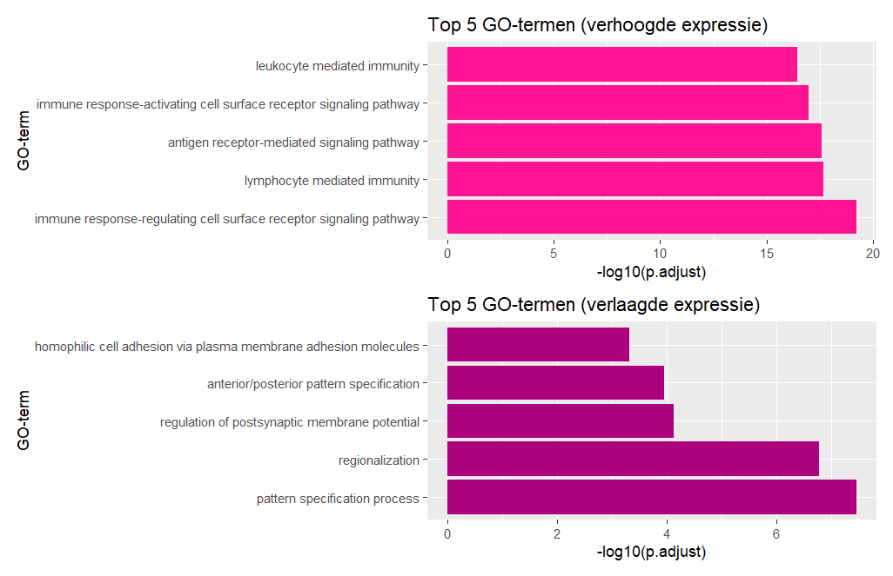

# Transcriptomics analyse reumatoide-artritis
Transcriptomics analyse in R van eiwit-gerelateerde genexpressie in reumatoïde artritis versus gezonde controles

# Introductie
Reumatoïde artritis (RA) is een chronische auto-immuun ontstekingsziekte en brengt schade en functieverlies toe aan de gewrichten. De ziekte kan zich ook extra-articulair manifesteren, waarbij er aantasting op treed aan de huid, ogen, hart, longen, nieren, zenuwstelsel en maagdarmstelsel (Radu & Bungau, 2021). RA komt wereldwijd voor bij 1-2% van de bevolking, en wordt bij vrouwen twee tot drie keer vaker aan getroffen dan in mannen (Kang et al., 2022). RA ontwikkeld zich in het begin met aspecifieke symptomen die kunnen overlappen met andere ziekten, dit maakt het lastig de aandoening in een vroeg stadium vast te stellen. Het niet behandelen van de ziekte leidt tot een verhoogd functieverlies en mortaliteit (Chauhan., et al). Verschillende medicijnen worden toegepast om de ziekte onder controle te houden en richten zich op ontstekingsmediatoren zoals tumornecrosefactor (TNF)-α, interleukine (IL)-6, en B-cellen. Deze behandelingen zijn niet voor iedere RA patiënt effectief, maar leiden wel tot nadelige bijwerkingen (Wang et al., 2024). Er is meer onderzoek nodig naar het identificeren van RA in patiënten en betere behandeling met geneesmiddelen. In dit onderzoek wordt een transcriptomics analyse uitgevoerd op RNA- sequence gegevens van RA patiënten. Hiermee wordt het genexpressie profiel van RA patiënten in kaart gebracht om mogelijke bio markers op te sporen. Hiermee wordt er hopelijk bij gedragen aan een beter begrip van potentiële behandelmogelijkheden, cel regulatie en de regulerende netwerken in de ontwikkeling van RA.

# Methode
**Synoviale weefselmonsters**

De RNA-sequnce gegevens van de synovium biopten werden verkregen uit eerder uitgevoerd onderzoek (Platzer et al., 2019). In totaal werden 8 monsters verzameld, bestaande uit monsters van 4 ACPA positieve vrouwen met RA (gemiddelde leeftijd 59.8 ± 4.9) en monsters van 4 gezonde vrouwen (gemiddelde leeftijd 29.8 ± 11.1 ). 

**Data analyse**

Data analyse van de gegevens werd uitgevoerd in R studio. Reads zijn aan de hand van kwaliteit controles getrimd en vervolgens gemapt tegen het humane referentiegenoom GRCh38 met behulp van de align() functie uit de Rsubread package. Genexpressie-kwantificatie werd uitgevoerd met featureCounts functie uit de Rsubread package, resulterend in een gen-telling matrix. Significant verschillen in genexpressie werden geanalyseerd met de DESeq2 package. Om het aantal fout-positieve resultaten te beperken werden de p-waardes (FDR), gecorrigeerd met de Benjamini-Hochberg methode. GO-enrichment analyse werdt vervolgens uitgevoerd met het package clusterProfiler en onderscheid gemaakt tussen verlaagde en verhoogde genexpressie met een log2 fold change drempel van 0.5 en -0.5. De top 5 GO-termen werden gevisualiseerd met de package ggplot2. Om inzicht te krijgen van de belangrijkste genen werden de twee belangrijkste GO-termen geanalyseerd met een KEGG-analyse met de package KEGGREST.

# Resultaten 
**Gene Ontology (GO)**
De top 5 verrijkte GO-termen voor verhoogde en verlaagde genexpressie zijn weergegeven in de barplot(resultaten/go_termen.png). Hier in is te zien dat voornamelijk verhoogde expressie van genen leiden tot verschillen in biologische processen

# conclusie 
